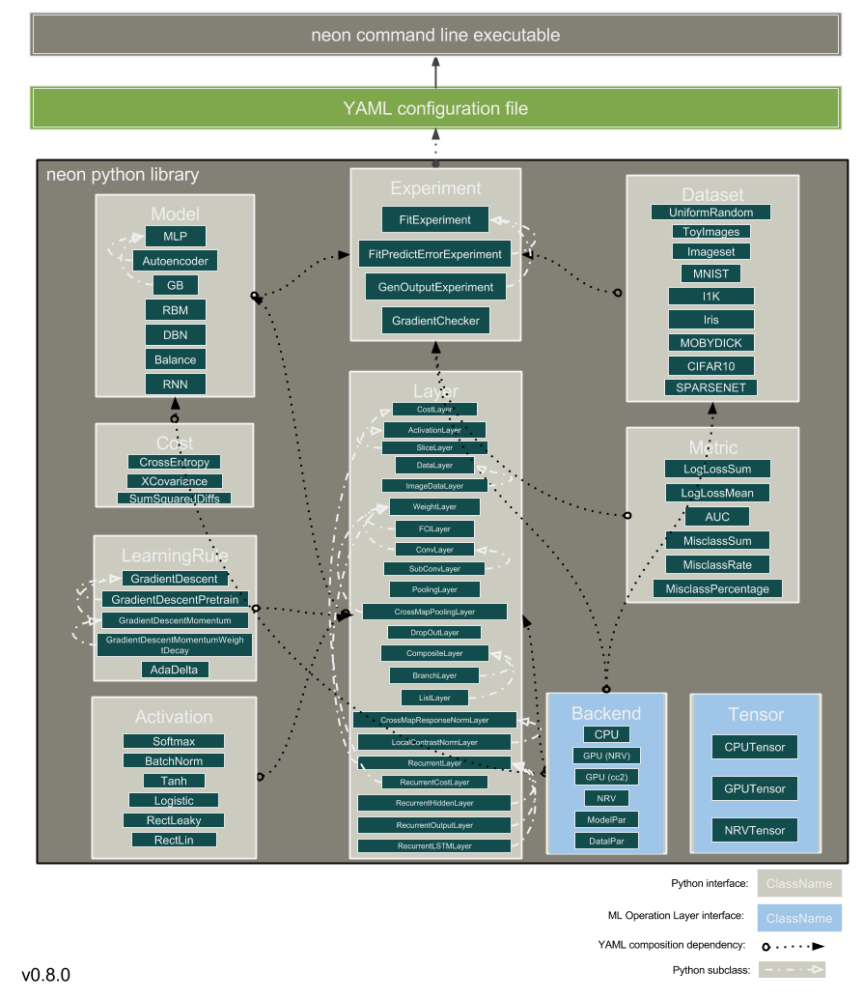

.. ---------------------------------------------------------------------------
.. Copyright 2014 Nervana Systems Inc.
.. Licensed under the Apache License, Version 2.0 (the "License");
.. you may not use this file except in compliance with the License.
.. You may obtain a copy of the License at
..
..      http://www.apache.org/licenses/LICENSE-2.0
..
.. Unless required by applicable law or agreed to in writing, software
.. distributed under the License is distributed on an "AS IS" BASIS,
.. WITHOUT WARRANTIES OR CONDITIONS OF ANY KIND, either express or implied.
.. See the License for the specific language governing permissions and
.. limitations under the License.
.. ---------------------------------------------------------------------------
.. currentmodule:: neon
.. _api:

*************
API Reference
*************

Architecture
------------

API Functions
-------------

.. _api.functions:

Backends
========

.. autosummary::
   :toctree: generated/

   neon.backends.backend.Backend
   neon.backends.backend.Tensor

CPU
---

.. autosummary::
   :toctree: generated/

   neon.backends.cpu.CPU
   neon.backends.cpu.CPUTensor

Cudanet GPU
-----------

.. autosummary::
   :toctree: generated/

   neon.backends.cc2.GPU
   neon.backends.cc2.GPUTensor

Nervana GPU
-----------

.. autosummary::
  :toctree: generated/

  neon.backends.gpu.GPU

Nervana Hardware
----------------

To add

Models
======

.. autosummary::
   :toctree: generated/

   neon.models.model.Model

MLP
---

.. autosummary::
   :toctree: generated/

   neon.models.mlp.MLP

Autoencoder
-----------

.. autosummary::
   :toctree: generated/

   neon.models.autoencoder.Autoencoder

Balance Network
---------------

.. autosummary::
   :toctree: generated/

   neon.models.balance.Balance

RBM
---

.. autosummary::
   :toctree: generated/

   neon.models.rbm.RBM

DBN
---

.. autosummary::
   :toctree: generated/

   neon.models.dbn.DBN

Recurrent Neural Network
------------------------

.. autosummary::
   :toctree: generated/

   neon.models.rnn.RNN

Layers
======

.. autosummary::
   :toctree: generated/

   neon.layers.layer.Layer

Cost Layer
----------

.. autosummary::
   :toctree: generated/

   neon.layers.layer.CostLayer

Activation Layer
----------------

.. autosummary::
   :toctree: generated/

   neon.layers.layer.ActivationLayer
   neon.layers.layer.SliceLayer

Data Layer
----------

.. autosummary::
   :toctree: generated/

   neon.layers.layer.DataLayer
   neon.layers.layer.ImageDataLayer

Weight Layer
------------

.. autosummary::
   :toctree: generated/

   neon.layers.layer.WeightLayer

Fully Connected Layer
---------------------

.. autosummary::
   :toctree: generated/

   neon.layers.fully_connected.FCLayer

Convolutional Layer
-------------------

.. autosummary::
   :toctree: generated/

   neon.layers.convolutional.ConvLayer
   neon.layers.convolutional.SubConvLayer

Pooling Layers
---------------

.. autosummary::
   :toctree: generated/

   neon.layers.pooling.PoolingLayer
   neon.layers.pooling.CrossMapPoolingLayer

DropOut Layer
-------------

.. autosummary::
   :toctree: generated/

   neon.layers.dropout.DropOutLayer

Composite Layers
----------------

.. autosummary::
   :toctree: generated/

   neon.layers.compositional.CompositeLayer
   neon.layers.compositional.BranchLayer
   neon.layers.compositional.ListLayer

Normalized Layers
-----------------

.. autosummary::
   :toctree: generated/

   neon.layers.normalizing.CrossMapResponseNormLayer
   neon.layers.normalizing.LocalContrastNormLayer

Boltzmann Layers
----------------

.. autosummary::
   :toctree: generated/

   neon.layers.boltzmann.RBMLayer

Recurrent Layers
----------------

.. autosummary::
   :toctree: generated/

   neon.layers.recurrent.RecurrentLayer
   neon.layers.recurrent.RecurrentCostLayer
   neon.layers.recurrent.RecurrentHiddenLayer
   neon.layers.recurrent.RecurrentOutputLayer
   neon.layers.recurrent.RecurrentLSTMLayer

Learning Rules
==============

.. autosummary::
   :toctree: generated/

   neon.optimizers.learning_rule.LearningRule

Gradient Descent
----------------

.. autosummary::
   :toctree: generated/

   neon.optimizers.gradient_descent.GradientDescent
   neon.optimizers.gradient_descent.GradientDescentPretrain
   neon.optimizers.gradient_descent.GradientDescentMomentum
   neon.optimizers.gradient_descent.GradientDescentMomentumWeightDecay
   neon.optimizers.adadelta.AdaDelta
   neon.optimizers.rmsprop.RMSProp

Parameter Related
=================

Value Initialization
--------------------

.. autosummary::
   :toctree: generated/

   neon.params.val_init.UniformValGen
   neon.params.val_init.AutoUniformValGen
   neon.params.val_init.GaussianValGen
   neon.params.val_init.SparseEigenValGen
   neon.params.val_init.NodeNormalizedValGen
   neon.params.val_init.OrthoNormalizedValGen

Metrics
=======

Misclassification
-----------------

.. autosummary::
   :toctree: generated/

   neon.metrics.misclass.MisclassSum
   neon.metrics.misclass.MisclassRate
   neon.metrics.misclass.MisclassPercentage

ROC
---

.. autosummary::
   :toctree: generated/

   neon.metrics.roc.AUC

Loss
----

.. autosummary::
   :toctree: generated/

   neon.metrics.loss.LogLossSum
   neon.metrics.loss.LogLossMean

Squared Error
-------------

.. autosummary::
   :toctree: generated/

   neon.metrics.sqerr.SSE
   neon.metrics.sqerr.MSE

Transforms
==========

Activation Functions
--------------------

.. autosummary::
   :toctree: generated/

   neon.transforms.linear.Linear
   neon.transforms.rectified.RectLin
   neon.transforms.rectified.RectLeaky
   neon.transforms.logistic.Logistic
   neon.transforms.tanh.Tanh
   neon.transforms.softmax.Softmax
   neon.transforms.batch_norm.BatchNorm

Cost Functions
--------------

.. autosummary::
   :toctree: generated/

   neon.transforms.sum_squared.SumSquaredDiffs
   neon.transforms.cross_entropy.CrossEntropy
   neon.transforms.xcov.XCovariance

Datasets
========

.. autosummary::
   :toctree: generated/

   neon.datasets.dataset.Dataset
   neon.datasets.imageset.Imageset

MNIST
-----

.. autosummary::
   :toctree: generated/

   neon.datasets.mnist.MNIST

CIFAR10
-------

.. autosummary::
   :toctree: generated/

   neon.datasets.cifar10.CIFAR10

CIFAR100
--------

.. autosummary::
   :toctree: generated/

   neon.datasets.cifar100.CIFAR100

Iris
----

.. autosummary::
   :toctree: generated/

   neon.datasets.iris.Iris

Sparsenet
---------

.. autosummary::
   :toctree: generated/

   neon.datasets.sparsenet.SPARSENET

Mobydick
--------

.. autosummary::
   :toctree: generated/

   neon.datasets.mobydick.MOBYDICK

Synthetic
---------

.. autosummary::
   :toctree: generated/

   neon.datasets.synthetic.UniformRandom
   neon.datasets.synthetic.ToyImages

Experiments
===========

.. autosummary::
   :toctree: generated/

   neon.experiments.experiment.Experiment
   neon.experiments.fit.FitExperiment
   neon.experiments.fit_predict_err.FitPredictErrorExperiment
   neon.experiments.check_grad.GradientChecker

Miscellaneous
=============

.. autosummary::
   :toctree: generated/

   neon.util.compat.PY3
   neon.util.compat.range
   neon.util.compat.StringIO

   neon.util.batch_writer.BatchWriter
   neon.util.batch_writer.BatchWriterImagenet
