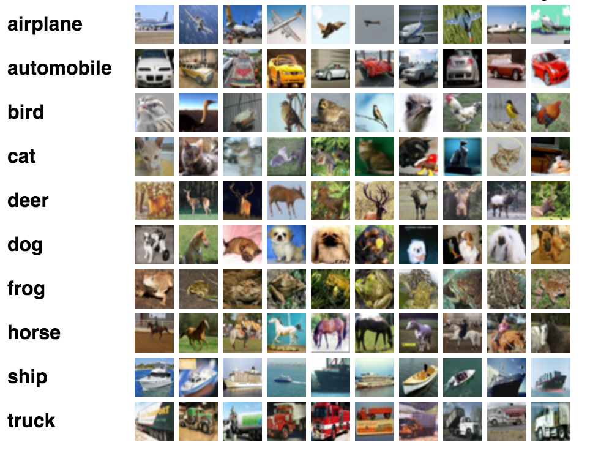

Convolutional Neural Network example
====================================

This tutorial introduces image classification with convolutional neural
networks. We will train a small convolutional neural network to classify images.

We will show you how to:

1. Build a small convolutional network in neon.
2. Train on the CIFAR-10 dataset.
3. Feed the network a new image to classify into one of 10 categories.

The associated ipython notebook can be found `here <https://github.com/NervanaSystems/meetup/blob/master/cifar_example.ipynb>`_.

Setting up the model
--------------------
To set up the model, we need the following ingredients:

* The CIFAR10 dataset
* Layer configurations and a model
* A compute backend
* An optimizer to train the model.
* callbacks to keep us updated about the progress of training.

We start by generating the backend:

.. code-block:: python

    from neon.backends import gen_backend
    be = gen_backend(backend='mkl', batch_size=128)

There isn't much we can do with the backend right now, but if we print it, you will
see that we have a CPU backend object.

.. code-block:: python

    print be

Loading a dataset
-----------------

The CIFAR-10 dataset consists of 60,000 images, each with size 32x32 pixels and
3 color channels. The images belong to 10 classes:

The dataset is provided in canned form, and will be downloaded
from the web the first time you run this. It just returns numpy
arrays with the pixel values, and class labels.  The stock datasets
are encapsulated in Dataset class objects which contain all the
metadata required for accessing the data.

.. code-block:: python

    
    from neon.data import CIFAR10
    cifar10_dataset = CIFAR10()

We put the dataset into a format neon can understand by creating an ArrayIterator
instance. Doing so moves the data onto the compute device (e.g. GPU or CPU)
and provides an iterator that returns training minibatches.  The data iterators
are generated by the DataSet class and the training and validation sets can
be access through the attributes ``train_iter`` and ``valid_iter``, respectively.

.. code-block:: python

    train_set = cifar10_dataset.train_iter
    test_set = cifar10_dataset.valid_iter

Network layers
--------------

Neon supports many layer types, including Linear Convolution, Bias, Activation, and Pooling.
For commonly used combinations, neon provides shortcuts:

* Conv = Convolution + Bias + Activation
* Affine = Linear + Bias + Activation

We are going to create a tiny network with two Conv, two Pooling, and
two Affine layers.

We first assemble the layers in a list:

.. code-block:: python

    from neon.layers import Conv, Affine, Pooling
    from neon.initializers import Uniform
    from neon.transforms.activation import Rectlin, Softmax
    init_uni = Uniform(low=-0.1, high=0.1)
    layers = [Conv(fshape=(5,5,16), init=init_uni, activation=Rectlin()),
              Pooling(fshape=2, strides=2),
              Conv(fshape=(5,5,32), init=init_uni, activation=Rectlin()),
              Pooling(fshape=2, strides=2),
              Affine(nout=500, init=init_uni, activation=Rectlin()),
              Affine(nout=10, init=init_uni, activation=Softmax())]

Each convolution layer has a filter size set by the parameter ``fshape``, which should
be a tuple (width, height, # of filters). The final Affine layer has 10 hidden units, corresponding
to the 10 categories in the dataset.

We now set up our model:

.. code-block:: python

    from neon.models import Model
    model = Model(layers)

Cost function
-------------

Next we need a cost function to evaluate the output of the network. The cost function compares network outputs with ground truth labels, and produces and error that we can backpropagate through the layers of the network. Here we use the cross-entropy error.

.. code-block:: python

    from neon.layers import GeneralizedCost
    from neon.transforms import CrossEntropyMulti
    cost = GeneralizedCost(costfunc=CrossEntropyMulti())

Optimizer
---------
We now have a cost function that we want to minimize, typically by following the negative gradient of the cost. This is called gradient descent. We do this iteratively over small batches of the data set, making it stochastic gradient descent (SGD).

.. code-block:: python

    from neon.optimizers import GradientDescentMomentum, RMSProp
    optimizer = GradientDescentMomentum(learning_rate=0.005,
                                        momentum_coef=0.9)

Callbacks
---------

To provide feedback during model training, users can specify a set of callbacks that are evaluated at the end of every iteration (minibatch) or pass through the dataset (epoch). Callbacks include evaluating the model on a validation set or computing misclassification percentage. There are also callbacks for saving to disk and for generating visualizations. Here we will set up a progress bar to monitor training.

.. code-block:: python

    # Set up callbacks. By default sets up a progress bar
    from neon.callbacks.callbacks import Callbacks
    callbacks = Callbacks(model, train_set)

Training the model
------------------

Now all the pieces are in place to run the network. We use the fit function and pass it a dataset, cost, optimizer, and the callbacks we set up.

.. code-block:: python

    model.fit(dataset=train_set, cost=cost, optimizer=optimizer,  num_epochs=5, callbacks=callbacks)

Congrats! If you made it this far you have trained a convolutional network in neon.

Evaluating the model
--------------------

We can now compute the misclassification on the test set to see how well we did.

.. code-block:: python

    from neon.transforms import Misclassification
    error_pct = 100 * model.eval(test_set, metric=Misclassification())
    print 'Misclassification error = %.1f%%' % error_pct

By tweaking some of the hyperparameters (number of layers, adding dropout...) we can improve the performance.
This was quite a lot of code! Generally, to set up a new model from scratch it is best to follow one of the examples from the neon/examples directory. It's easy to mix and match parts!

Inference
---------
Now we want to grab a new image from the internet and classify it through our network.

.. code-block:: python

    # an image of a frog from wikipedia
    img_source = "https://upload.wikimedia.org/wikipedia/commons/thumb/5/55/Atelopus_zeteki1.jpg/440px-Atelopus_zeteki1.jpg"

    # download the image
    import urllib
    urllib.urlretrieve(img_source, filename="image.jpg")

    # crop and resize to 32x32
    from PIL import Image
    import numpy as np

    img = Image.open('image.jpg')
    crop = img.crop((0,0,min(img.size),min(img.size)))
    crop.thumbnail((32, 32))
    crop = np.asarray(crop, dtype=np.float32)

We create an iterator with this image for inference. Because the model's buffers are already initialized with a minibatch
of size 128, we fill the rest with zeros.

.. code-block:: python

    from neon.data import ArrayIterator
    import numpy as np

    x_new = np.zeros((128,3072), dtype=np.float32)
    x_new[0] = crop.reshape(1,3072)/ 255

    inference_set = ArrayIterator(x_new, None, nclass=nclass, lshape=(3, 32, 32))

Get model outputs on the inference data:

.. code-block:: python

    classes =["airplane", "automobile", "bird", "cat", "deer",
              "dog", "frog", "horse", "ship", "truck"]
    out = model.get_outputs(inference_set)
    print classes[out[0].argmax()]
