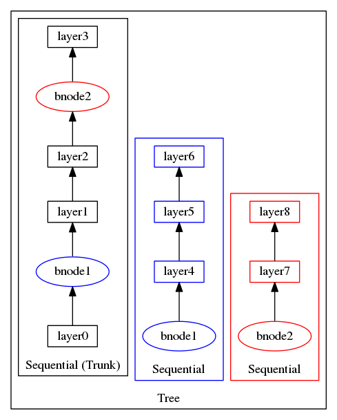

.. ---------------------------------------------------------------------------
.. Copyright 2015 Nervana Systems Inc.
.. Licensed under the Apache License, Version 2.0 (the "License");
.. you may not use this file except in compliance with the License.
.. You may obtain a copy of the License at
..
..      http://www.apache.org/licenses/LICENSE-2.0
..
.. Unless required by applicable law or agreed to in writing, software
.. distributed under the License is distributed on an "AS IS" BASIS,
.. WITHOUT WARRANTIES OR CONDITIONS OF ANY KIND, either express or implied.
.. See the License for the specific language governing permissions and
.. limitations under the License.
.. ---------------------------------------------------------------------------

Layer containers
================

Layer containers are used to wrap groups of layers to provide
convenience functions for iterating through them during training.
Containers also support efficiently allocating memory for outputs or
parameters that are shared between different layers.

Sequential
~~~~~~~~~~

|Sequential| containers are the
default container for models. This is the simplest type of container,
and used to encapsulate linear pathways of multiple layers. Upon
construction, a Sequential container will automatically flatten compound
layers (such as :py:class:`~.Conv` or :py:class:`~.Affine`). Calling
:py:meth:`~.Sequential.fprop` on a Sequential container will in turn call
``fprop`` on the constituent layers in its layers list.

Tree
~~~~

|Tree| containers are used to represent
branching pathways of layers where the overall structure has multiple
output nodes. The Tree is constructed by specifying a list of
|Sequential| containers. Each |Sequential| represents a pathway that
terminates in an output node. The pathways can be provided to the
|Tree| constructor as either a list of |Sequential| containers, or
as a list of list of layers, in which case each list will be implicitly
encapsulated in a |Sequential| during construction.

:py:class:`.BranchNode` is used to define branching points for the Tree.

The following are equivalent:

.. code-block:: python

    bnode = BranchNode()
    layer_list = [
                  [Conv((3,3,2), init=ifunc), bnode, Affine(nout=32, init=ifunc)],
                  [bnode, Conv((3,3,2), init=ifunc), Affine(nout=16, init=ifunc)]
                 ]
    t = Tree(layers=layer_list, alphas=[1., 1.])

.. code-block:: python

    bnode = BranchNode()
    layer_list = [
                  Sequential([Conv((3,3,2), init=ifunc), bnode, Affine(nout=32, init=ifunc)]),
                  Sequential([bnode, Conv((3,3,2), init=ifunc), Affine(nout=16, init=ifunc)])
                 ]
    t = Tree(layers=layer_list, alphas=[1., 1.])

The layer pathways must be specified in the order of precedence from the
root of the tree. So the “trunk” of the tree must be provided first,
then the subsequent pathways in the order which they occur up the tree.
All non-trunk pathways must start with an instantiated BranchNode layer
that also occurs in the trunk at the point of branching.

Multiple branching points can be used to construct complex networks. The
figure below shows a branching model with three output nodes, and how
that model is constructed from a list of containers.

.. figure:: assets/tree_structure.png

An example of how to create a branching model using a Tree container is
provided in `mnist_branch.py <https://github.com/NervanaSystems/neon/blob/master/examples/mnist_branch.py>`__.

During training, the backpropagated errors of each branch are combined
using the weighting parameters in the ``alphas`` list. By default, all
branches are equally weighted (``alphas`` are given default value of all
ones).

During inference, only the trunk branch (first |Sequential|) is
evaluated.

MergeBroadcast
~~~~~~~~~~~~~~

|MergeBroadcast| containers
consist of multiple Sequential pathways that receive input from a single
input layer (the broadcast), and then combine their outputs via
concatenation (the merge). A |MergeBroadcast| container’s layers
attribute consists of multiple |Sequential| containers, each
representing one of the pathways receiving the broadcasted input. The
output of the |MergeBroadcast| is the merged output of the Sequential
members of layers. The method of concatenation is specified by the merge
argument, which indicates the axis along which to concatenate. As in
Tree, the provided layers list can consist of either |Sequential|
objects or lists of layers which will be converted to |Sequential|
objects during construction.

MergeMultistream
~~~~~~~~~~~~~~~~

:py:class:`MergeMultistream<neon.layers.container.MergeMultistream>` containers
are special cases of the |MergeBroadcast| container, except that they
originate from the input provided to the model, by ``ArrayIterator``,
for example. Instead of broadcasting from an input layer to their
internal |Sequential| pathways, each pathway gets its own input, that
is unpacked from the input object. One scenario may be if the data
source provides a tuple of :py:class:`.Tensor`, with each :py:class:`.Tensor` meant as
input to each pathway (stream).

.. |Sequential| replace:: :py:class:`Sequential<neon.layers.container.Sequential>`
.. |Tree| replace:: :py:class:`Tree<neon.layers.container.Tree>`
.. |MergeBroadcast| replace:: :py:class:`.MergeBroadcast`
