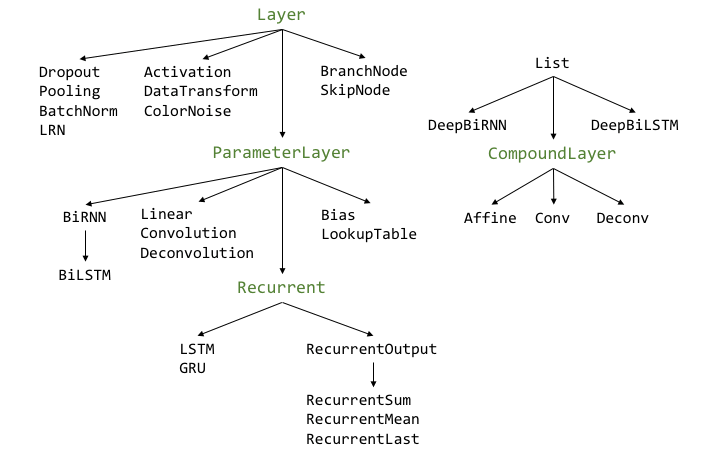

.. ---------------------------------------------------------------------------
.. Copyright 2015 Nervana Systems Inc.
.. Licensed under the Apache License, Version 2.0 (the "License");
.. you may not use this file except in compliance with the License.
.. You may obtain a copy of the License at
..
..      http://www.apache.org/licenses/LICENSE-2.0
..
.. Unless required by applicable law or agreed to in writing, software
.. distributed under the License is distributed on an "AS IS" BASIS,
.. WITHOUT WARRANTIES OR CONDITIONS OF ANY KIND, either express or implied.
.. See the License for the specific language governing permissions and
.. limitations under the License.
.. ---------------------------------------------------------------------------

Layers
======

To specify the architecture of a model, we can create a network by
concatenating layers in a list:

.. code-block:: python

    from neon.layers import Affine
    from neon.initializers import Gaussian
    from neon.transforms import Rectlin

    init = Gaussian()

    # add three affine (all-to-all) layers
    layers = []
    layers.append(Affine(nout=100, init=init, bias=init, activation=Rectlin()))
    layers.append(Affine(nout=50, init=init, bias=init, activation=Rectlin()))
    layers.append(Affine(nout=10, init=init, bias=init, activation=Rectlin()))

Each layer has several core methods:

.. csv-table::
   :header: "Method", "Description"
   :widths: 20, 40
   :escape: ~
   :delim: |

   ``configure(self, in_obj)`` | Define the layer's ``out_shape`` and ``in_shape``
   ``allocate(self, shared_outputs=None)`` | Allocate the ``output`` buffer (if needed)
   ``fprop(self, inputs, inference=False)`` | Forward propagate the activation based on the tensor ``inputs``. If ``inference``, do not store the outputs.
   ``bprop(self, error)`` | Backward propagate the tensor ``error`` and return the gradients

During model training, the provided training data is propagated through
the model's layers, calling the ``configure`` method to set the
appropriate layer shapes. Then, each layer's ``allocate`` method is
called to allocate any needed buffers.

Layer taxonomy
--------------

The base classes :py:class:`neon.layers.Layer<neon.layers.layer.Layer>`, :py:class:`neon.layers.ParameterLayer<neon.layers.layer.ParameterLayer>`,
and :py:class:`neon.layers.CompoundLayer<neon.layers.layer.CompoundLayer>` form the classes from which all other
layers should inherit. These base classes are not meant to be directly
instantiated. The figure below is a taxonomy of all the layers
implemented in neon ( :math:`B\leftarrow A` means that :math:`B` inherits from :math:`A`).

Layer
-----

Because these layers do not have weights, they do *not* need to be
instantiated with a ``neon.initializers.Initializer``. Below is
table of the layers, their key layer-specific parameters, and a
description.

.. csv-table::
    :header: "Layer", "Parameters", "Description"
    :widths: 20, 20, 40
    :delim: |

    :py:class:`neon.layers.Dropout<neon.layers.layer.Dropout>` | ``keep=0.5`` | At each ``fprop`` call, retains a random ``keep`` fraction of units
    :py:class:`neon.layers.Pooling<neon.layers.layer.Pooling>` | ``fshape, op, strides, padding`` | Pools over a window ``fshape`` (height, width, num_filters) with the operation ``op`` (either `"max"` or `"avg"`).
    :py:class:`neon.layers.BatchNorm<neon.layers.layer.BatchNorm>` | ``rho=0.9`` | Z-scores each minibatch's input, then scales with :math:`f(z) = \gamma z + \beta`. See `Ioffe, 2015 <http://arxiv.org/abs/1502.03167)>`__
    :py:class:`neon.layers.LRN<neon.layers.layer.LRN>` | ``alpha=1``, ``beta=0``, ``ascale=1``, ``bpower=1`` | Performs local response normalization (see Section 3.3 in `Krizhevsky, 2012 <http://www.cs.toronto.edu/~fritz/absps/imagenet.pdf>`__)
    :py:class:`neon.layers.Activation<neon.layers.layer.Activation>` | ``transform`` | Applies ``transform`` (:py:class:`neon.transforms.Transform<neon.transforms.transform.Transform>`) to the input
    :py:class:`neon.layers.BranchNode<neon.layers.layer.BranchNode>` | | Inserts a branching node (see Layer containers)
    :py:class:`neon.layers.SkipNode<neon.layers.layer.SkipNode>` | | Layer that allows pass-through

Parameter Layers
----------------

These layers with weights inherit from :py:class:`neon.layers.ParameterLayer<neon.layers.layer.ParameterLayer>`,
which handles the buffering and tracking of the weight parameters. They
should be initialized with an Initializer
(``neon.initializers.Initializer``). For example,

.. code-block:: python

    from neon.layers import Linear
    from neon.initializers import Gaussian

    layers = Linear(nout = 100, init = Gaussian())

.. csv-table::
    :header: "Layer", "Parameters", "Description"
    :widths: 20, 20, 40
    :delim: |

    :py:class:`neon.layers.Linear <neon.layers.layer.Linear>` | ``nout`` | Linear all-to-all layer with ``nout`` units
    :py:class:`neon.layers.Convolution <neon.layers.layer.Convolution>` | ``fshape``, ``strides``, ``padding`` | Convolves the input with filters of size ``fshape`` (height, width, num_filters).
    :py:class:`neon.layers.Deconvolution <neon.layers.layer.Deconvolution>` | ``fshape``, ``strides``, ``padding`` | Applies deconvolution with filters of size ``fshape``
    :py:class:`neon.layers.LookupTable <neon.layers.layer.LookupTable>` | ``vocab_size``, ``embedding_dim`` | Embeds input with ``vocab_size`` number of unique symbols to ``embedding_dim`` dimensions
    :py:class:`neon.layers.Bias <neon.layers.layer.Bias>` | | Adds a learned bias to the input

Compound Layers
---------------

Filtering or linear layers are often combined with a bias and an
activation function. For convenience, we use
:py:class:`neon.layers.CompoundLayer<neon.layers.layer.CompoundLayer>` which are simply a list of layers, to
initialize these layers. For example,

.. code-block:: python

    from neon.layers import Conv
    from neon.initializers import Gaussian, Constant
    from neon.transforms import Rectlin

    layers = Conv((11, 11, 64), init=Gaussian(scale=0.01), bias=Constant(0),
                  activation=Rectlin(), name = "myConv")

This code will create a convolution layer, followed by a bias layer and
a rectified linear activation layer. By default, the convolution layer
will be given the name ``"myConv"``, the bias layer ``"myConv_bias"``,
and the activation layer ``"myConv_Rectlin"``.

.. csv-table::
    :header: "Layer", "Description"
    :widths: 20, 20
    :delim: |

    :py:class:`neon.layers.Affine <neon.layers.layer.Affine>` | ``Linear`` -> ``Bias`` -> ``Activation``
    :py:class:`neon.layers.Conv <neon.layers.layer.Conv>` | ``Convolution`` -> ``Bias``-> ``Activation``
    :py:class:`neon.layers.Deconv <neon.layers.layer.Deconv>` | ``Deconvolution`` -> ``Bias`` -> ``Activation``

Recurrent Layers
----------------

Recurrent layers inherit from the base class :py:class:`neon.layers.Recurrent<neon.layers.recurrent.Recurrent>`.
The number of recurrent units is specified by the argument
``output_size``. These layers also require the arguments
``init (Initializer)`` and ``activation (Transform)`` to seed the
model's weights and activation function for the inputs-to-hidden units
connections. An optional argument is ``init_inner``, which initializes
the models' recurrent parameters. If absent, the initializer provided
with ``init`` will be used.

Additional layer-specific parameters are specified below:

.. csv-table::
    :header: "Layer", "Parameters", "Description"
    :widths: 20, 20, 40
    :delim: |

    :py:class:`neon.layers.Recurrent <neon.layers.recurrent.Recurrent>` | | Recurrent layer with all-to-all connections
    :py:class:`neon.layers.LSTM <neon.layers.recurrent.LSTM>` | ``gate_activation`` | Long Short-Term Layer (LSTM) implementation
    :py:class:`neon.layers.GRU <neon.layers.recurrent.GRU>` | ``gate_activation`` | Gated Recurrent Unit (GRU)

Examples of a recurrent layer with tanh units:

.. code-block:: python

    from neon.initializers import Uniform, GlorotUniform
    from neon.layers import Recurrent, Affine, GRU
    from neon.transforms import Tanh, Softmax, Logistic
    init = Uniform(low=-0.08, high=0.08)

    # Recurrent layer with tanh units
    layers = [Recurrent(500, init, activation=Tanh()),
              Affine(1000, init, bias=init, activation=Softmax())]

LSTM layer with embedding for word analysis:

.. code-block:: python

    # LSTM layer with embedding layer
    layers = [
        LSTM(128, g_uni, activation=Tanh(),
             gate_activation=Logistic()),
        RecurrentSum(),
        Dropout(keep=0.5),
        Affine(2, g_uni, bias=GlorotUniform(), activation=Softmax())
    ]

Network with two stacked GRU layers:

.. code-block:: python

    # set common parameters
    rlayer_params = {"output_size": hidden_size, "init": init,
                     "activation": Tanh(), "gate_activation": Logistic()}

    # initialize two GRU layers
    rlayer1, rlayer2 = GRU(**rlayer_params), GRU(**rlayer_params)

    # build full model
    layers = [
        LookupTable(vocab_size=1000, embedding_dim=200, init=init),
        rlayer1,
        rlayer2,
        Affine(1000, init, bias=init, activation=Softmax())
    ]

Summary layers
~~~~~~~~~~~~~~

A recurrent layer can be followed with layers that collapse over the
time dimension in interesting ways. These layers do not have
weights/parameters and therefore do not undergo any learning.

.. csv-table::
    :header: "Layer", "Description"
    :widths: 20, 20
    :delim: |

    :py:class:`neon.layers.RecurrentSum <neon.layers.recurrent.RecurrentSum>` | Sums unit output over time
    :py:class:`neon.layers.RecurrentMean <neon.layers.recurrent.RecurrentMean>` | Averages unit output over time
    :py:class:`neon.layers.RecurrentLast <neon.layers.recurrent.RecurrentLast>` | Retains output from last time step only

If a recurrent layer is followed by, for example, an ``Affine`` layer,
and not one of the above summary layers, then the ``Affine`` layer has
connections to all the units from the different time steps.
