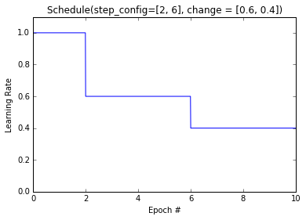
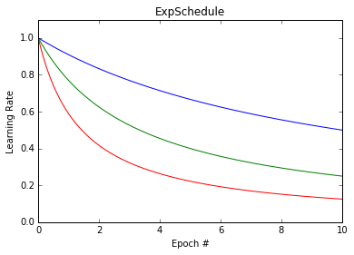
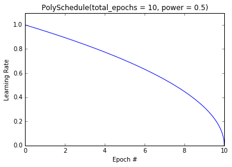

Learning schedules
==================

Some optimizers (such as ``neon.optimizers.GradientDescentMomenum``),
and any custom optimizers you may create, can also be initialized with a
learning rate schedule to adjust the learning rate over training epochs.

.. csv-table::
    :header: Function, Description
    :widths: 20, 20
    :delim: |

    :py:class:`neon.optimizers.Schedule<neon.optimizers.optimizer.Schedule>` | Constant or step learning rate
    :py:class:`neon.optimizers.ExpSchedule<neon.optimizers.optimizer.ExpSchedule>` | Exponential decay
    :py:class:`neon.optimizers.PolySchedule<neon.optimizers.optimizer.PolySchedule>` | Polynomial learning rate

Schedule
--------

This class can be configured to implement a constant, linear, or step
learning rate. By default, schedule is a constant learning rate.

.. code-block:: python

    # Constant learning rate of 0.01 across training epochs
    optimizer = GradientDescentMomentum(0.01, 0.9, schedule = Schedule())

To set a step schedule, pass the arguments ``step_config`` and
``change``. The schedule will multiply the learning rate by ``change``
during each epoch # provided in the list ``step_config``. For example,
the following call:

.. code-block:: python

    # Lower the LR to 0.6 at step 2, and 0.4 at step 6.
    schedule = Schedule(step_config=[2, 6], change=[0.6, 0.4])

    # Use learning rate of 1.0
    optimizer = GradientDescentMomentum(1.0, 0.9, schedule=schedule)

yields the learning rate schedule below:

ExpSchedule
-----------

To set a decaying schedule, use ``ExpSchedule`` and pass the decay rate
``decay``. This schedule implements

.. math::

   \alpha(t) = \frac{\alpha_\circ}{1 + \beta t}

where :math:`\beta` is the decay rate, and :math:`\alpha_\circ` is the initial learning rate.

.. code-block:: python

    # Blue line
    s = ExpSchedule(decay=0.1)

    # Green line
    s = ExpSchedule(decay=0.3)

    # Red line
    s = ExpSchedule(decay=0.7)

yields different decay rates:

PolySchedule
------------

A polynomial schedule takes as input the total number of epochs :math:`T` and a power :math:`\beta`, and produces the learning schedule:

.. math::

   \alpha(t) = \alpha_\circ \times\left(1-\frac{t}{T}\right)^\beta

where :math:`\alpha_\circ` is the initial learning rate. For example,

.. code-block:: python

    schedule = PolySchedule(total_epochs = 10, power = 0.7)

yields (with the initial learning rate set at 1.0):

