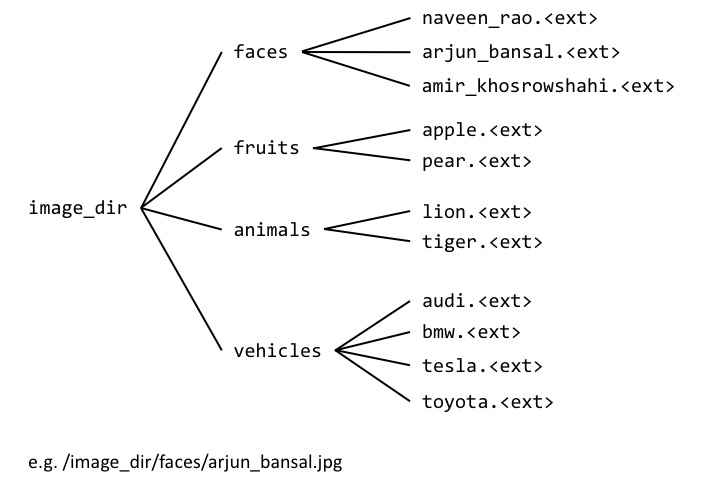

Data loading
============

There are two components to working with data in neon. The first is a
data iterator (:py:class:`.NervanaDataIterator`), that feeds the model with
minibatches of data during training or evaluation. The second is a
dataset (:py:class:`Dataset`) class, which handles the loading and preprocessing
of the data. When working with your own data, the latter is optional
although highly recommended.

Data iterators are python iterables in that they implement the
``__iter__`` method, which returns a new minibatch of data with each
call.

* If your data is small enough to fit into memory:

    * For image data or other data in the form of numpy arrays, use |ArrayIterator|.
    * For specific modalities, neon includes specialized iterators (Text, Image Captioning, Q&A)

* If your data is too large:
    * For data in the HDF5 format, use the |HDF5Iterator| to load chunks of data to send to the model. This approach is flexible for
      any type of data. 
    * For other types of data, use the macrobatching DataLoader, a specialized loader that loads macrobatches of data into memory, and then splits the macrobatches into minibatches to feed the model. This can be used for images, audio, video datasets and is recommended for large datasets or high-performance applications.

ArrayIterator
-------------

The |ArrayIterator| class provides for iteration over
minibatches of data that has been preloaded into memory as numpy arrays.
This iterator supports classification, regression, and autoencoder
tasks.

Classification
~~~~~~~~~~~~~~

Below is an example of a classification task with images where we load
in 10,000 images. Each image is 32x32 pixels with 3 color channels (R,
G, B), for a total of :math:`32\times32\times3=3,072` features.

.. code-block:: python

    from neon.data import ArrayIterator
    import numpy as np

    """
    X are the features and y are the labels.
    The data in X must have shape (# examples, feature size)
    """
    X = np.random.rand(10000,3072) # X.shape = (10000, 3072)
    """

    For classification, the labels y must have shape (# examples, 1). y must also
    consist of integers from 0 to nclass-1, where nclass is the number of categories.
    """
    y = np.random.randint(0,10,10000) # y.shape = (10000, )

    """
    The features X and labels y are passed to ArrayIterator be loaded into the backend
    nclass, the number of classes, is set to 10
    lshape, the local shape of the features, is set to (3,32,32) to represent
            the the image dimensions: 32x32 pixels with 3 channels
    """
    train = ArrayIterator(X=X, y=y, nclass=10, lshape=(3,32,32))

Importantly, the labels :math:`y` for classification should be integers from :math:`0` to :math:`K-1`,  where
:math:`K` is the number of classes. These labels are stored in the backend in a one-hot representation. This means that if we have :math:`N` labels with :math:`K` classes, the labels will be stored in a :math:`N \times K` binary matrix. Each column will be all zeros except at the :math:`k`-th element, which will be one. For example,

.. math::

   y = (0,0,1,3,2,2) \rightarrow \left( \begin{array}{cccccc}
   1 & 1 & 0 & 0 & 0 & 0\\
   0 & 0& 1 & 0 & 0 & 0 \\
   0 & 0& 0 & 0 & 1 & 1\\
   0 & 0& 0 & 1 & 0 & 0 \end{array}  \right).

Regression
~~~~~~~~~~

In regression, the model output for each training example is a vector :math:`\hat{y}` that is compared against a desired vector :math:`y` with a cost function (such as mean squared error). Below is a simple example implementing linear regression.

We first create the iterator. By default, ``ArrayIterator`` assumes
classification, so for regression we must set ``make_onehot = False`` to
turn off the one-hot representation.

.. code-block:: python

    from neon.data import ArrayIterator
    import numpy as np

    X = np.random.rand(1000, 1)
    y = 2*X + 1 + 0.01*np.random.randn(1000, 1)  # y = 2X+1 with some gaussian noise
    train = ArrayIterator(X=X, y=y, make_onehot=False)

We then fit a linear model with a bias term using stochastic gradient
descent:

.. code-block:: python

    from neon.initializers import Gaussian
    from neon.optimizers import GradientDescentMomentum
    from neon.layers import Linear, Bias
    from neon.layers import GeneralizedCost
    from neon.transforms import SumSquared
    from neon.models import Model
    from neon.callbacks.callbacks import Callbacks

    # Linear layer with one unit and a bias layer
    init_norm = Gaussian(loc=0.0, scale=0.01)
    layers = [Linear(1, init=init_norm), Bias(init=init_norm)]

    mlp = Model(layers=layers)

    # Loss function is the squared difference
    cost = GeneralizedCost(costfunc=SumSquared())

    # Learning rules
    optimizer = GradientDescentMomentum(0.1, momentum_coef=0.9)

    # run fit
    mlp.fit(train, optimizer=optimizer, num_epochs=10, cost=cost,
            callbacks=Callbacks(mlp))

    # print weights
    slope = mlp.get_description(True)['model']['config']['layers'][0]['params']['W']
    print "slope = ", slope
    bias_weight = mlp.get_description(True)['model']['config']['layers'][1]['params']['W']
    print "bias = ", bias_weight

After training, the weights match what we expect:

.. code-block:: python

    slope =  [[ 2.01577163]]
    bias =  [[ 1.01664519]]

Autoencoders
~~~~~~~~~~~~

Autoencoders are a special case of regression where the desired outputs :math:`y` are the input features :math:`X`. For convenience, you can exclude passing the labels :math:`y` to the iterator:

.. code-block:: python

    # Example construction of ArrayIterator for Autoencoder task with MNIST
    from neon.data import MNIST

    mnist = MNIST()

    # load the MNIST data
    (X_train, y_train), (X_test, y_test), nclass = mnist.load_data()

    # Set input and target to X_train
    train = ArrayIterator(X_train, lshape=(1, 28, 28))

For the full example, see ``examples/conv_autoencoder.py``.

Specialized ArrayIterators
~~~~~~~~~~~~~~~~~~~~~~~~~~

Neon includes specialized iterators that subclass from
``NervanaDataIterator`` for specific modalities where the entire dataset
can be directly loaded into memory.

.. csv-table::
   :header: "Name", "Description"
   :widths: 20, 40
   :escape: ~
   :delim: |

   :py:class:`neon.data.Text<neon.data.text.Text>` | Iterator for processing and feeding text data
   :py:class:`neon.data.ImageCaption<neon.data.imagecaption.ImageCaption>` | Iterator for feeding an image and a sentence for each training example
   :py:class:`neon.data.QA<neon.data.questionanswer.QA>` | Data iterator for taking a Q&A dataset, which has already been vectorized, and feeding data to training

For more information on usage of these iterators, see the API
documentation.

Sequence data
~~~~~~~~~~~~~
For sequence data, where data are fed to the model across multiple time steps, the shape
of the input data can depend on your usage.

* Often, data such as sentences are encoded as a vector sequence of integers, where each integer corresponds to a word in the vocabulary. This encoding is often used in conjunction with embedding layers. In this case, the input data should be formatted to have shape :math:`(T, N)`, where :math:`T` is the number of time steps and :math:`N` is the batch size. The embedding layer takes this input and provides as output to a subsequent recurrent neural network data of shape :math:`(F, T * N)`, where :math:`F` is the number of features (in this case, the embedding dimension). For an example, see `imdb_lstm.py <https://github.com/NervanaSystems/neon/blob/master/examples/imdb_lstm.py>`_.

* When the sequence data uses a one-hot encoding, the input data should be formatted to have shape :math:`(F, T*N)`. For example, if sentences use a one-hot encoding with 50 possible characters, and each sentence is 60-characters long, the input data will have shape :math:`(F=50, 60*N)`. See the :py:class:`.Text` class, or the `char_lstm.py <https://github.com/NervanaSystems/neon/blob/master/examples/char_lstm.py>`_ example.

* Time series data should be formatted to have shape :math:`(F, T * N)`, where :math:`F` is the number of features. For an example, see `timeseries_lstm.py <https://github.com/NervanaSystems/neon/blob/master/examples/timeseries_lstm.py>`_.

HDF5Iterator
-------------

For datasets that are too large to fit in memory the |HDF5Iterator| class can be used.  This uses
an HDF5 formatted data file to store the input and target data arrays so the data size is not limited
by on-host and/or on-device memory capacity.  To use the |HDF5Iterator|, the data arrays need to be
stored in an HDF5 file with the following format:

* The input data is in an HDF5 dataset named `input` and the target output, if needed, in a dataset named `output`. The data arrays are of the same format as the arrays used to initialize the |ArrayIterator| class. 

* The `input` data class also requires an attribute named `lshape` which specifies the shape of the flattened input data array. For mean subtraction, an additional dataset named `mean` can be included in the HDF5 file which includes either a channel-wise mean vector or a complete mean image to subtract from the input data.

For alternate target label formats, such as converting the targets to a one-hot vector, or for autoencoder
data, the |HDF5IteratorOneHot| and |HDF5IteratorAutoencoder| subclasses are included.
These subclasses demonstrate how to extend the HDF5Iterator to handle different input and target data formats
or transformations.

See the example, `examples/mnist_hdf5.py`, for how to format the HDF5 data file
for use with the |HDF5Iterator| class.

DataLoader
----------

If your data is too large to load directly into memory, use a
macrobatching approach. In macrobatching, the data is loaded in smaller
batches, then split further into minibatches to feed the model.
neon supports macrobatching with image, audio, and video datasets using
the :py:class:`.DataLoader` class. 

:py:class:`.DataLoader` was created to provide a way to feed images
from disk to neon with minimal latency. The module takes advantage of
the high compressibility of images to conserve disk space and disk to
host memory IO. DataLoader uses a multithreaded library to hide the
latency of decoding images, applying augmentation and/or
transformations, and transferring the resulting outputs to device memory
(if necessary). The module also adds optional functionality for applying
transformations to images (scale, flip, and rotation).

Data format
~~~~~~~~~~~

The :py:class:`.DataLoader` supports several ways to organize the data:

1. CSV manifest files
2. General directory structure
3. Macrobatched data

CSV manifest files
~~~~~~~~~~~~~~~~~~

The most common approach is to provide training and validation *.csv* files, each containing
file path and label indexes (for classification). The manifest file should contain a header line
(that is ignored). Subsequent lines will have one record per line, formatted as:

.. code-block:: bash

    filename, label
    <path_to_image_1>,<label_1>
    <path_to_image_2>,<label_2>
    ...
    <path_to_image_N>,<label_N>

For example:

.. code-block:: bash

    filename, label
    /image_dir/faces/naveen_rao.jpg, 0
    /image_dir/faces/arjun_bansal.jpg, 0
    /image_dir/faces/amir_khosrowshahi.jpg, 0
    /image_dir/fruits/apple.jpg, 1
    /image_dir/fruits/pear.jpg, 1
    /image_dir/animals/lion.jpg, 2
    /image_dir/animals/tiger.jpg, 2
    ...
    /image_dir/vehicles/toyota.jpg, 3

The manifest file is shuffled if the ``shuffle`` parameter to the DataLoader constructor is set to ``True``

If the specified paths are not absolute (i.e. starts with ‘/’), then the
path will be assumed to be relative to the location of the csv file.

For example, see the ``examples/whale_calls.py`` script.

General Directory Structure
^^^^^^^^^^^^^^^^^^^^^^^^^^^

This option presumes that your data is provided as a directory of
images, that are organized in a hierarchy as follows:

In this organization, there are :math:`K=4` categories, with each category containing a variable number of images.
The :py:class:`.DataLoader` will write out CSV files mapping the file location
to an integer corresponding to the category label index. Note that to generate training/validation splits, the user
should provide separate directories for training and testing. Alternatively, use the generated manifest file and partition into separate manifest files.

Macrobatches
~~~~~~~~~~~~

Macrobatches are simply archive files that package
together many data files (jpegs) to take advantage of disk locality. The
container for these macrobatches is designed to be compatible with the
GNU tool ``cpio``.

During runtime, the :py:class:`.DataLoader` will generate macrobatches from the
data, if they do not exist. These macrobatches can then be used as direct input
on subsequent training runs.

Alternatively, users can pre-generate macrobatches using the 
``neon.util.batch_writer.py`` script. Macrobatch datasets can be generated with this script 
from four types of raw image sources:

1. General directory structure

Assuming the same directory structure as mentioned above, the following command illustrates how to 
invoke ``batch_writer.py`` in this scenario:

.. code-block:: python

    python neon/data/batch_writer.py  --data_dir /usr/local/data/macrobatch_out \
                                      --image_dir /usr/local/data/raw_images \
                                      --set_type directory \
                                      --target_size 256 \
                                      --macro_size 5000 \
                                      --file_pattern "*.jpg"

In this command, the images will be loaded from
*/usr/local/data/raw_images* and the macrobatches written to
*/usr/local/data/macrobatch_out*. Images that are larger than the
``target_size=256`` will be scaled down (e.g. a 512x768 image will be
rescaled to 256x384, but a 128x128 will be untouched). Each macrobatch
will have at most ``macro_size=5000`` images.

2. CSV Manifest file

For data formatted as a CSV Manifest file (see above), the batch writer 
can then be invoked by calling:

.. code-block:: bash

    python neon/data/batch_writer.py  --data_dir /usr/local/data/macrobatch_out \
                                      --image_dir /location/of/csv_files \
                                      --set_type csv

3. ImageNet 1K tar files

The ImageNet task is recognition task is described on the
`ILSVRC <http://www.image-net.org/challenges/LSVRC/>`__ website. The
1.3M training images, 50K validation images, and development kit are
provided as TAR archives. Because the images are organized in a way that
makes them unamenable to the generalized directory structure described
above, we provide some special handling to properly unpack the TARs and
correctly associate the category names to the integer labels. ImageNet
macrobatches can be created using the following command:

.. code-block:: bash

    python neon/data/batch_writer.py  --data_dir /usr/local/data/macrobatch_out \
                                      --image_dir /usr/local/data/I1K_tar_location \
                                      --set_type i1k

In this command, the ``file_pattern``, ``target_size``, and
``macro_size`` arguments are handled as defaults. The only difference
are the ``set_type`` argument and the ``image_dir`` argument. The
``image_dir`` should contain the three TAR files that are provided by
ILSVRC:

.. code-block:: bash

    ILSVRC2012_img_train.tar
    ILSVRC2012_img_val.tar
    ILSVRC2012_devkit_t12.tar.gz

Ensure that the disk where ``data_dir`` is located has sufficient space
to hold the resulting macrobatches as well as space for the unpacked
images (these can be deleted once the macrobatches have been written).
Since the dataset is relatively large, an SSD can greatly speed up the
batch writing process.

4. CIFAR-10 numpy arrays (pickled)

The CIFAR10 dataset is provided as a pickled set of numpy arrays
containing the uncompressed pixel buffers of each image. This dataset is
small enough to easily fit in host memory. However, the
|ArrayIterator| module does not allow for random flipping, cropping,
or shuffling. We therefore added the ability to write out CIFAR10 data
as macrobatches to work with :py:class:`.ImageLoader` :

.. code-block:: bash

    python neon/data/batch_writer.py  --data_dir /usr/local/data/macrobatch_out \
                                      --set_type cifar10 \
                                      --target_size 40

CIFAR10 images are 32x32, so if the ``target_size`` argument is omitted,
then the images will be written out as 32x32. However, in many
scenarios, one might wish to zero-pad the images so that random cropping
can be done without further reducing the feature map size. Setting
``target_size`` to the desired padded image size instructs the batch
writer to center the image in the target feature map size and pad the
border with the means of that image along each channel. See
``numpy.pad`` for more details.

Because CIFAR images are so small, we have found that JPEG encoding of
the images can negatively impact the accuracy of classification
algorithms, so in this case we use lossless PNG encoding as the format
to dump into the macrobatches.

Invoking the DataLoader
~~~~~~~~~~~~~~~~~~~~~~~

The :py:class:`.DataLoader` constructor takes several arguments (see the API), including a `media_params`, which
specifies the type of media being loaded and provides additional parameters. For images, an example invocation is:

.. code-block:: python

    shape = dict(channel_count=3, height=32, width=32)
    train_params = ImageParams(center=False, aspect_ratio=110, **shape)
    train = DataLoader(set_name='train', repo_dir=train_dir, media_params=train_params,
                       shuffle=True, target_size=1, nclasses=10)

For images, transformations specified by :py:class:`.ImageParams` will be performed on-the-fly. For supported
transformations, see the :py:class:`.ImageParams` documentation.

For audio, use the :py:class:`.AudioParams` object to provide the needed parameters to the data loader:

.. code-block:: python

    common_params = dict(sampling_freq=2000, clip_duration=2000, frame_duration=80, overlap_percent=50)
    train_params = AudioParams(random_scale_percent=5, **common_params)
    train = DataLoader(set_name='train', repo_dir=train_dir, media_params=train_params,
                       index_file=train_idx, target_size=1, nclasses=2)

Here, several important metadata are supplied, such as the sampling frequency and the maximum duration of audio clips, as well as FFT-related parameters for generating the spectrogram such as frame_duration and overlap_percent. For more information, see the :py:class:`.AudioParams` documentation and the ``whale_calls.py`` and ``music_genres.py`` scripts.

For video, use the :py:class:`.VideoParams` class. We first define image parameters for the frames, and those parameters are then supplied to constructor the VideoParams object. For example:

.. code-block:: python

    shape = dict(channel_count=3, height=112, width=112, scale_min=128, scale_max=128)
    frame_params = ImageParams(center=False, flip=True, **shape)
    trainParams = VideoParams(frame_params=frame_params, frames_per_clip=16)
    train = DataLoader(set_name='train', repo_dir=traindir, media_params=trainParams,
                       shuffle=True, target_size=1, nclasses=101, datum_dtype=np.uint8)

ImageLoader
~~~~~~~~~~~

neon maintains backwards compatibility with the old :py:class:`.ImageLoader` class. For more details
on how to use the old system, see documentation for neon v1.4.0.

.. |ArrayIterator| replace:: :py:class:`.ArrayIterator`
.. |DataLoader| replace:: :py:class:`.DataLoader`
.. |HDF5Iterator| replace:: :py:class:`.HDF5Iterator`
.. |HDF5IteratorOneHot| replace:: :py:class:`.HDF5IteratorOneHot`
.. |HDF5IteratorAutoencoder| replace:: :py:class:`.HDF5IteratorAutoencoder`

