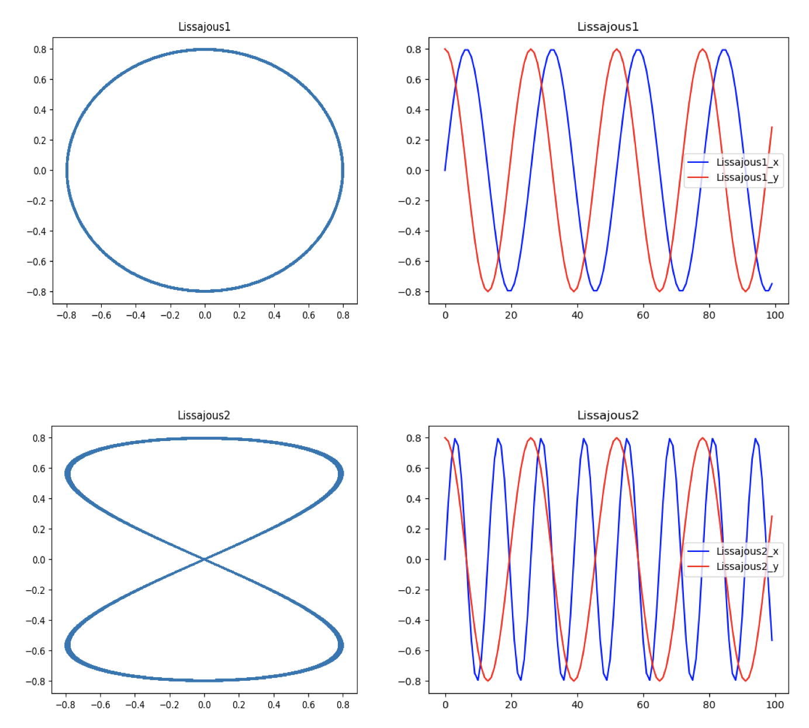
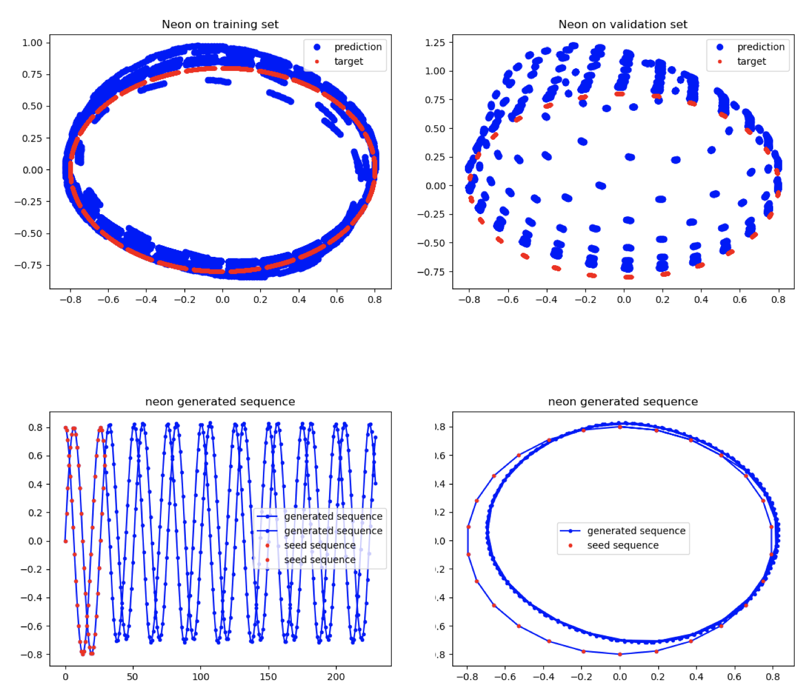

Timeseries forecasting tutorial
=============

This tutorial will guide you through building and training a recurrent neural network for
forecasting using time-series data. We will use synthetic data for this purpose, and train a recurrent neural network with Long-Short Term Memory (LSTM) units.

Objective
----------
In this tutorial, we will train an LSTM to forecast the path of the Lissajous curve. Given an input sequence of length `N`  (set using the command line argument ``--seq_len``), an LSTM model can be set up to forecast the next M locations on the path (`M` is either `1` or `N`, set using the command ``--predict_seq``). LSTM networks can also be used as generative models, to generate entire sequence, by repeatedly feeding newly forecasted locations back into the model.

Synthetic data
------------

We have provided a helper class ``SyntheticTimeSeries`` in ``examples/utils.py`` that can be used to generate synthetic data.
We used the Lissajous curve, which is generated by two harmonic oscillators or sinusoids plotted orthogonally. The shape of the curve is parameterized by two values - the ratio of frequencies, and the phase shift. For this implementation, phase shift is fixed at `90°`. Users can set the frequency ratio ``sin_scale`` to either ``2.0`` (Lissajous1, which is a circle) or ``1.0`` (Lissajous2, which looks like the digit `8` ).

The curves for Lissajous1 and Lissajous2 are shown below. The figures on the right plot the `x` and `y` values separately. If ``matplotlib`` is installed, these images are generated and saved to file.

The type of curve can be selected by setting ``--curvetype Lissajous1`` or ``--curvetype Lissajous2`` on the command line.

The following code snippet generates synthetic data for training and validating the model.

.. code-block:: python

    # Feature dimension of the input (for Lissajous curve, this is 2)
    feature_dim = 2
    # Output feature dimension (for Lissajous curve, this is 2)
    output_dim = 2
    # number of sinusoidal cycles
    no_cycles = 2000
    # number of data points per cycle
    no_points = 13

    # Generate Lissajous Curve
    time_series = SyntheticTimeSeries(npoints=no_points, ncycles=no_cycles,
                                 curvetype=args.curvetype)

Please note the data feature dimension for the synthetic Lissajous curve data is 2. However the script and LSTM model can process sequences with an arbitrary number of dimensions.

Data loading
------------

We have provided a helper class ``DataIteratorSequence`` in ``examples/utils.py`` that takes the synthetic data as input and returns an iterator providing data in batches suitable for RNN prediction.  It is meant for use when the entire dataset is small enough to fit in memory (which is the case for the synthetic data generated as above).

.. code-block:: python

    # use data iterator to feed X, Y. return_sequence determines training
    # strategy
    train_set = DataIteratorSequence(
        time_series.train, seq_len, return_sequences=args.predict_seq)
    valid_set = DataIteratorSequence(
        time_series.test, seq_len, return_sequences=args.predict_seq)

Now we have the iterators needed for training and evaluation.

Model specification
-------------------

Initialization
~~~~~~~~~~~~~~

For most of the layers, we use Xavier Glorot's `initialization
scheme <http://jmlr.org/proceedings/papers/v9/glorot10a/glorot10a.pdf>`__
to automatically scale the weights and preserve the variance of input
activations.

.. code-block:: python

    # define weights initialization
    init = GlorotUniform()  # Uniform(low=-0.08, high=0.08)

Topology
~~~~~~~~
The network consists of an LSTM, RecurrentLast and Affine layers.

1. :py:class:`.LSTM` is a recurrent layer with "long short-term memory" units. LSTM networks are good at learning temporal dependencies during training, and often perform better than standard RNN layers.
2. :py:class:`.RecurrentLast` is a recurrent output layer that only keeps the recurrent layer output at the last time step. This may or may not be used, depending on whether ``--predict_seq`` is specified.
3. :py:class:`.Affine` is a fully connected layer for reducing the dimension of the LSTM outputs from ``recurrent_units`` to ``nfeatures``.

.. code-block:: python

    # Number of recurrent units in the network
    recurrent_units = 32

    # define model: model is different for the 2 strategies (sequence target
    # or not)
    if args.predict_seq:
        layers = [
            LSTM(recurrent_units, init, activation=Logistic(),
                 gate_activation=Tanh(), reset_cells=False),
            Affine(train_set.nfeatures, init, bias=init, activation=Identity())
        ]
    else:
        layers = [
            LSTM(recurrent_units, init, activation=Logistic(),
                 gate_activation=Tanh(), reset_cells=True),
            RecurrentLast(),
            Affine(train_set.nfeatures, init, bias=init, activation=Identity())
        ]

    model = Model(layers=layers)

Cost, Optimizers, and Callbacks
~~~~~~~~~~~~~~~~~~~~~~~~~~~~~~~

For training, we use the RMSProp optimizer and the Mean Squared Error cost function. Default callbacks are used for showing the progress during training, as well as to save the trained model in the location specified using --args.save_path.

.. code-block:: python

    # cost and optimizer
    cost = GeneralizedCost(MeanSquared())
    optimizer = RMSProp(stochastic_round=args.rounding)

    callbacks = Callbacks(model, eval_set=valid_set, **args.callback_args)

Model Training
-----------

Training the model for under ten epochs should be sufficient to obtain some interesting results, and avoid overfitting on this small dataset. This should take a few minutes.

.. code-block:: python

     # fit model
     model.fit(train_set,
              optimizer=optimizer,
              num_epochs=args.epochs,
              cost=cost,
              callbacks=callbacks)

Next, we run the model on the training and validation data and calculate the error in the prediction. For this, we have provided a function ``err`` available in ``utils.py`` which calculates the mean squared error between predictions and their corresponding targets.

.. code-block:: python

    # run the trained model on train and valid dataset and see how the outputs
    # match
    train_output = model.get_outputs(
        train_set).reshape(-1, train_set.nfeatures)
    valid_output = model.get_outputs(
        valid_set).reshape(-1, valid_set.nfeatures)
    train_target = train_set.y_series
    valid_target = valid_set.y_series

    # calculate accuracy
    terr = err(train_output, train_target)
    verr = err(valid_output, valid_target)

    neon_logger.display('terr = %g, verr = %g' % (terr, verr))

For example, running the command

.. code-block:: console

    python ./timeseries_lstm.py --curvetype Lissajous1 --predict_seq

should return output similar to the following:

.. code-block:: bash

    Epoch 0   [Train |████████████████████|    5/5    batches, 0.66 cost, 0.29s]
    Epoch 1   [Train |████████████████████|    5/5    batches, 0.51 cost, 0.33s]
    Epoch 2   [Train |████████████████████|    5/5    batches, 0.21 cost, 0.33s]
    Epoch 3   [Train |████████████████████|    5/5    batches, 0.04 cost, 0.31s]
    Epoch 4   [Train |████████████████████|    5/5    batches, 0.01 cost, 0.44s]
    Epoch 5   [Train |████████████████████|    5/5    batches, 0.00 cost, 0.46s]
    Epoch 6   [Train |████████████████████|    5/5    batches, 0.00 cost, 0.35s]
    Epoch 7   [Train |████████████████████|    5/5    batches, 0.00 cost, 0.40s]
    Epoch 8   [Train |████████████████████|    5/5    batches, 0.00 cost, 0.34s]
    Epoch 9   [Train |████████████████████|    5/5    batches, 0.00 cost, 0.30s]
    2018-01-26 15:09:43,127 - neon - DISPLAY - terr = 0.320929, verr = 0.0566725

Time Sequence Generation
---------

The trained model can now be used to generate new curves, by repeatedly feeding the output of the model back into the input. When generating sequences, the batch size and input sequence length are both set to 1, which are different from the training stage. As the original trained model object has certain memory and mechanism configurations based on these parameters, we can create a new model. We will then demonstrate how to copy the weights from one trained model to a new model and start inference.

.. code-block:: python

    # when generating sequence, set sequence length to 1, since it doesn't
    # make a difference
    be.bsz = 1
    seq_len = 1

    if args.predict_seq:
        layers = [LSTM(recurrent_units, init, activation=Logistic(), gate_activation=Tanh(), reset_cells=False),
         Affine(train_set.nfeatures, init, bias=init, activation=Identity())]
    else:
        layers = [LSTM(recurrent_units, init, activation=Logistic(), gate_activation=Tanh(), reset_cells=False),
        RecurrentLast(),
        Affine(train_set.nfeatures, init, bias=init, activation=Identity())]

    model_new = Model(layers=layers)

Wrap the new layers into a new model, initialize with the weights we just trained.

.. code-block:: python

    # load the weights
    model_new.load_params(args.save_path)
    model_new.initialize(dataset=(train_set.nfeatures, seq_len))

For a given seed sequence, forecast `200` subsequent locations as follows:

.. code-block:: python

    num_predict = 200
    seed_seq_len = 30

    output = np.zeros((train_set.nfeatures, num_predict))
    seed = time_series.train[:seed_seq_len]

    x = model_new.be.empty((train_set.nfeatures, seq_len))
    for s_in in seed:
        x.set(s_in.reshape(train_set.nfeatures, seq_len))
        y = model_new.fprop(x, inference=False)

    for i in range(num_predict):
        # Take last prediction and feed into next fprop
        pred = y.get()[:, -1]
        output[:, i] = pred
        x[:] = pred.reshape(train_set.nfeatures, seq_len)
        y = model_new.fprop(x, inference=False)

    output_seq = np.vstack([seed, output.T])

If ``matplotlib`` is installed, the script generates four plots as output, shown below. The plots on top show the predicted and target locations for the training and validation data respectively. Plots below show the curve that was forecasted from a seed sequence.

This example shows a LSTM model for time series forecast. The process and modules used in this example are applicable to other type of time series analysis as well.