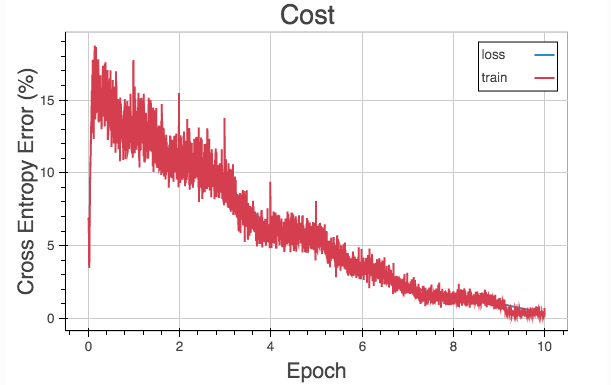
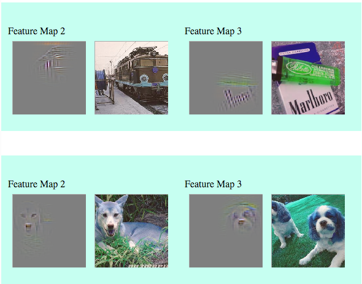
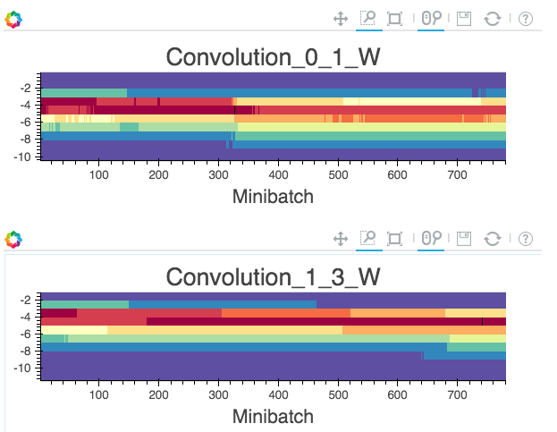

Visualization
=============

Neon comes with the ``nvis`` tool for easy visualization.

``nvis`` reads hdf5 data written out by neon callbacks and generates
`Bokeh <http://bokeh.pydata.org/en/latest/>`__ visualizations embedded
in html.

Note that Bokeh and nvis are not installed by default (due to the size
of the Bokeh package). To enable these be sure to first install via
``make -e VIS=true`` (or edit the Makefile to set the VIS variable). If
you’ve already installed neon without enabling visualization
dependencies you’ll need to touch vis\_requirements.txt prior to the
``make -e VIS=true`` call to ensure virtualenv python dependencies get
triggered.

Cost visualization
------------------

Visualization of training and validation set cost on an epoch or
minibatch axis is currently supported. The following example saves
training cost data from neon and creates a visualization with ``nvis``:

::

    neon examples/mnist_mlp.yaml -o data.h5
    nvis -i data.h5 -o .

If validation cost is computed in neon, it will also be saved and
visualized by nvis:

::

    neon examples/mnist_mlp.yaml -o data.h5 --eval_freq 1
    nvis -i data.h5 -o .

Here’s an example of the visualized output:

Script examples not directly using the ``neon`` command can still dump
visualization data:

::

    ./examples/cifar10_allcnn.py -o data.h5
    nvis -i data.h5 -o .

Layer deconvolution visualization
---------------------------------

`Guided Backprop <http://arxiv.org/pdf/1412.6806.pdf>`__ based
visualization of convolutional layer activations is also supported via
the :py:class:`DeconvCallback<neon.callbacks.callbacks.DeconvCallback>` class or :py:meth:`add_deconv_callback()<neon.callbacks.callbacks.Callbacks.add_deconv_callback>` function.
Note that unlike in the paper, :py:meth:`add_deconv_callback() does not support networks that utilize max pooling.

For example, one can provide the `--deconv` argument to ``examples/imagenet/allcnn.py`` to ensure that the callback gets added:

.. code-block:: bash

    examples/imagenet/allcnn.py -o data.h5 --deconv
    nvis -i data.h5 -o .

Here’s an example of the output.

Layer histogram visualization
-----------------------------

Per layer value histograms are also available via the
:py:class:`.HistCallback` class or
:py:meth:`~.add_hist_callback` function. To
use this, create :py:class:`.Callbacks` and call :py:meth:`~.add_hist_callback`. For
example, edit the ``examples/cifar10_allcnn.py`` script by adding the
following line after ``callbacks`` is initialized:

.. code-block:: python

    callbacks.add_hist_callback(plot_per_mini=True)

Then, at each minibatch or epoch, the model weights for every minibatch.
We run the model then generate the visualization:

.. code-block:: bash

    ./cifar10_allcnn.py -o data.h5 -e 1
    nvis -i data.h5 -o .

Here’s an example output for the first two convolution layers:

By default, the callback only saves the Tensor ``W`` from every layer
that has that attribute (e.g. all layers that inherit from
``ParameterLayer``). To build a histogram for your specific attribute,
pass a list to ``filter_key``.

.. code-block:: python

    callbacks.add_hist_callback(plot_per_mini=True, filter_key = ['W','dW','myParameter'])

Then, all layers that have ``self.W``, ``self.dW``, or
``self.myParameter`` will have those weights saved for visualization in
the specified output file.
