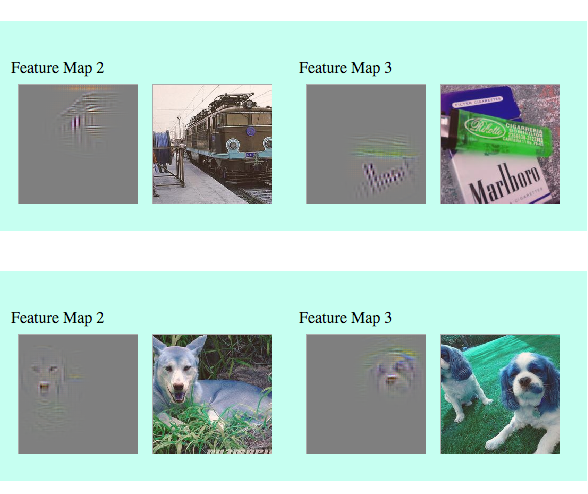
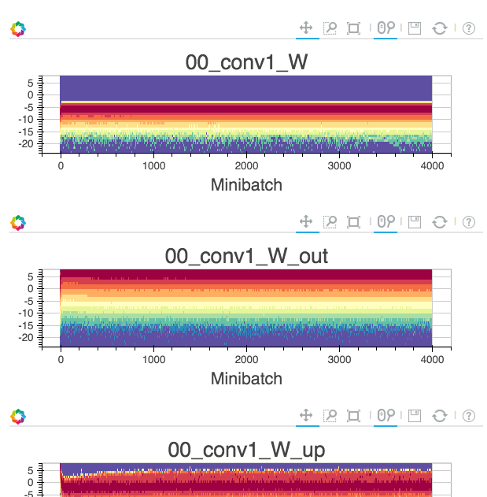

.. ---------------------------------------------------------------------------
.. Copyright 2015 Nervana Systems Inc.
.. Licensed under the Apache License, Version 2.0 (the "License");
.. you may not use this file except in compliance with the License.
.. You may obtain a copy of the License at
..
..      http://www.apache.org/licenses/LICENSE-2.0
..
.. Unless required by applicable law or agreed to in writing, software
.. distributed under the License is distributed on an "AS IS" BASIS,
.. WITHOUT WARRANTIES OR CONDITIONS OF ANY KIND, either express or implied.
.. See the License for the specific language governing permissions and
.. limitations under the License.
.. ---------------------------------------------------------------------------

Command Line Tools
==================

neon
----
.. autosummary::
   neon.util.argparser.NeonArgparser

``neon`` is our main command line interface executable.  A description of the
command line arguments that can be passed to it are outlined below (note that
these same arguments can also be used in your own python scripts by
incorporating :py:class:`NeonArgparser<neon.util.argparser.NeonArgparser>`).

.. literalinclude:: neon_help_output.txt

nvis
----
``nvis`` reads hdf5 data written out by neon callbacks and generates Bokeh_
visualizations embedded in html.

.. _Bokeh: http://bokeh.pydata.org/en/latest/

Note that Bokeh_ and ``nvis`` are not installed by default.  To enable these
be sure to first install via ``make -e VIS=true`` (or edit the Makefile to set
the ``VIS`` variable).  If you've already installed neon without enabling
visualization dependencies you'll need to ``touch vis_requirements.txt`` prior
to the ``make -e VIS=true`` call to ensure virtualenv python dependencies get
triggered.

Cost visualization
""""""""""""""""""
Visualization of training and validation set cost on an epoch or minibatch
axis is currently supported.

The following example shows dumping training cost data from ``neon`` and
visualizing it via ``nvis``:

.. code-block:: bash

    neon examples/mnist_mlp.yaml -o data.h5
    nvis -i data.h5 -o .

If validation cost is computed in ``neon``, it will also be saved and
visualized by ``nvis``:

.. code-block:: bash

    neon examples/mnist_mlp.yaml -o data.h5 --eval_freq 1
    nvis -i data.h5 -o .

Here's an example of the visualized output:

.. raw:: html
   :file: assets/cost-hist.html

Script examples not directly using the ``neon`` command can still dump
visualization data:

.. code-block:: bash

    examples/cifar10_allcnn.py -o data.h5
    nvis -i data.h5 -o .

Layer deconvolution visualization
"""""""""""""""""""""""""""""""""
Guided Backprop based visualization of convolutional layer activations is also
supported via the :py:class:`neon.callbacks.callbacks.DeconvCallback` class or 
:py:meth:`neon.callbacks.callbacks.Callbacks.add_deconv_callback` function.

.. code-block:: bash

    examples/imagenet_allcnn.py -o data.h5 --deconv
    nvis -i data.h5 -o .

Here's an example of the output.  Click `here (deconv) <http://neon.nervanasys.com/nvis/deconv.html>`_ to see the full visualization (57Mb, may take some time to load).

   Guided backprop layer visualizations

Layer histogram visualization
"""""""""""""""""""""""""""""
Per layer value histograms are also available via the 
:py:class:`neon.callbacks.callbacks.HistCallback` class or
:py:meth:`neon.callbacks.callbacks.Callbacks.add_hist_callback` function.

Here's an example of the output.  Click `here (histograms) <http://neon.nervanasys.com/nvis/alexnet_histograms.html>`_ to see the full visualization (60Mb, may take some time to load).

   Layer histograms
